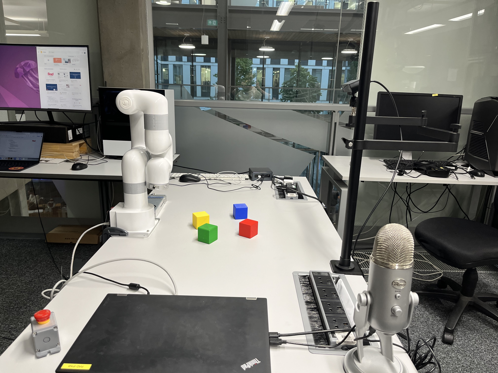

[](https://github.com/ipab-rad/lite6_ws/blob/rolling/.github/workflows/control.yaml) [](https://github.com/ipab-rad/lite6_ws/blob/rolling/.github/workflows/motion_planning.yaml)
# UFactory Lite6 Workspace
A default workspace configuration for the ufactory lite6 robot.


# Hardware Setup

# Software Setup

## Software Prerequisites
This workspaces requires the following software to be installed:

* An installation of Docker ([instructions](https://docs.docker.com/engine/install/ubuntu/))
* An installation of ROS rolling ([instructions](https://docs.ros.org/en/rolling/Installation.html))

## Local Setup
In order to install and build all workspace dependencies on your local machine all you need to run is:

```bash
./local_setup.sh
```

## Docker GUI Prerequisites
If you wish to run a container as a GUI application you need to first manage X-server authentication. The most basic way to do so is through enabling access to all local applications by running: 

```
xhost +local:
```

This is in general bad practice as it disables security settings for local applications. In order to authenticate the docker container alone the following command needs to be run to populate a temporary file which our docker build will use:

```
export DOCKER_XAUTH=/tmp/.docker.xauth
touch $DOCKER_XAUTH
xauth nlist $DISPLAY | sed -e 's/^..../ffff/' | xauth -f $DOCKER_XAUTH nmerge -
```

## Running Applications
