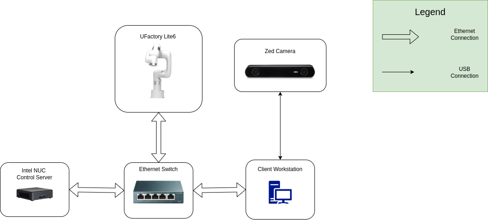
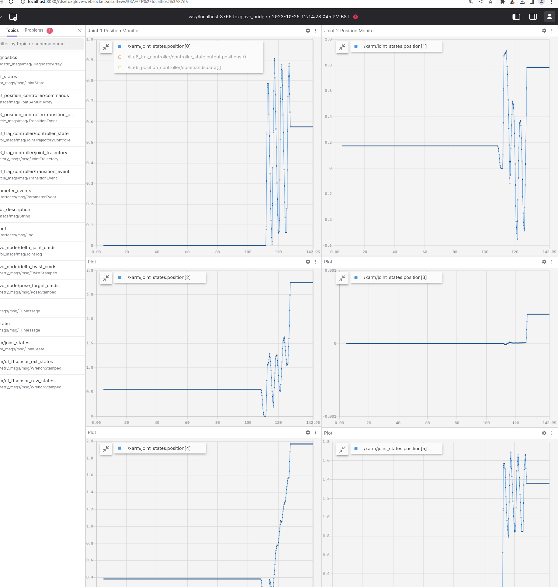

[](https://github.com/ipab-rad/lite6_ws/blob/rolling/.github/workflows/control.yaml) [](https://github.com/ipab-rad/lite6_ws/blob/rolling/.github/workflows/motion_planning.yaml) [](https://github.com/ipab-rad/lite6_ws/blob/rolling/.github/workflows/zed.yaml)
# UFactory Lite6 Workspace
This workspace serves as a template for setting up a ROS 2 workspace for performing robot learning research. 


# Hardware Setup


# Software Setup

## System Software Prerequisites
This workspaces requires the following software to be installed:

* An installation of Docker ([instructions](https://docs.docker.com/engine/install/ubuntu/))
* An installation of ROS rolling ([instructions](https://docs.ros.org/en/rolling/Installation.html))

## Build ROS workspace on host machine
In order to install and build all workspace dependencies on your local machine all you need to run is:

```bash
./local_setup.sh
```

## Docker GUI Prerequisites
If you wish to run a container that contains GUI applications (e.g. rviz) you need to first manage X-server authentication. The most basic way to do so is through enabling access to all local applications by running: 

```
xhost +local:
```

This is in general bad practice as it disables security settings for local applications. In order to authenticate the docker container alone the following command needs to be run to populate a temporary file which our docker build will use:

```
export DOCKER_XAUTH=/tmp/.docker.xauth
touch $DOCKER_XAUTH
xauth nlist $DISPLAY | sed -e 's/^..../ffff/' | xauth -f $DOCKER_XAUTH nmerge -
```

## Running Tutorials

### Motion Planning Tutorial
```bash
ros2 launch 
```
Please see [motion_planning_tutorial](placeholder.com) for further instructions.


### Control Tutorial



```bash
ros2 launch 
```
Please see [control_tutorial](placeholder.com) for further instructions.

### Policy Deployment Tutorial
```bash
ros2 launch 
```
Please see [policy_deployment_tutorial](placeholder.com) for further instructions.
